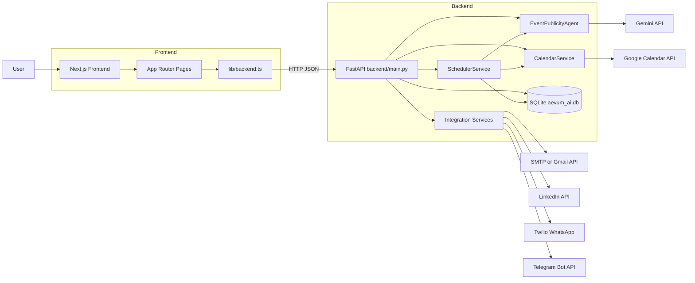
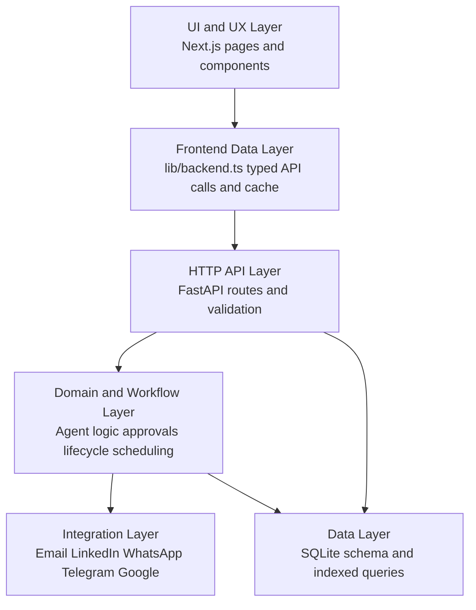
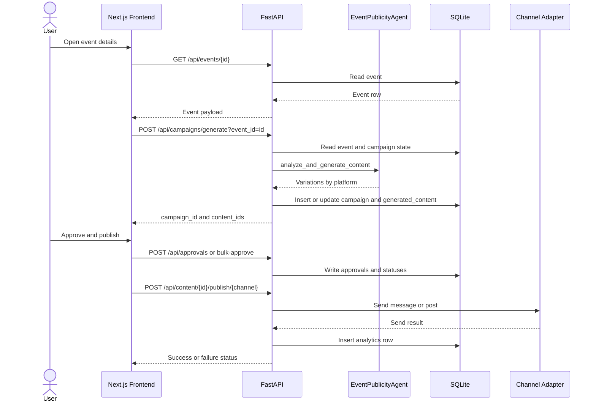

# Aevum AI — Architecture and Design

This document contains the detailed architecture, sequence diagrams, flows, and rationale for the Aevum AI project. It expands on the concise README and is intended for engineers onboarding to the repository.

## High-Level Overview

Aevum AI is an event publicity system with the following responsibilities:

- Ingest events from Google Calendar.
- Generate platform-specific draft content for events using an LLM (Gemini) with deterministic fallbacks.
- Persist generated drafts and metadata for auditability.
- Provide a review and approval workflow for operators.
- Publish approved content across multiple channels (email, LinkedIn, WhatsApp, Telegram).
- Run background scheduling jobs to auto-generate drafts for high-priority events.

### Layered Architecture

1. Presentation (Frontend): Next.js 16 + React 19 + TypeScript
2. Frontend Data Layer: `frontend/lib/backend.ts` typed API client
3. API (Backend): FastAPI routes and validation in `backend/main.py`
4. Domain Logic: `backend/agents/event_publicity_agent.py` with AI orchestration
5. Services: `backend/services/*` (calendar, scheduler, calendar sync)
6. Integrations: `backend/integrations/*` (email_service, linkedin_service, whatsapp_service, telegram_service)
7. Persistence: `backend/aevum_ai.db` (SQLite) managed via `backend/database.py`

## Architecture Diagram

## Stack Flow

## End-to-End Flows

### Dashboard Load

1. User opens dashboard.
2. Frontend (`frontend/app/dashboard`) uses `frontend/lib/backend.ts` to request snapshot endpoints concurrently.
3. FastAPI routes use optimized SQL queries against SQLite to collect analytics, events, campaigns, and approval counts.
4. Frontend renders the dashboard with cards and lists.

Reasons for design:
- Concurrent requests reduce perceived latency.
- Typed client centralizes API shape and reduces frontend/backed mismatch.

### Campaign Generation

1. User triggers generation from event detail.
2. Frontend POSTs to `/api/campaigns/generate` with event_id.
3. Backend reads event data from DB, constructs a prompt and context, and calls EventPublicityAgent.
4. Agent calls Gemini with a structured prompt; on missing/failed response, returns deterministic fallback templates.
5. Backend persists generated variations to `generated_content` and links them to campaigns.

Persistence rationale:
- Immediate persistence ensures auditability and supports re-generation without losing prior drafts.

### Approval & Publish

1. Operators approve drafts via `/api/approvals` endpoints.
2. Backend writes approval records and marks generated content as approved.
3. Publishing endpoints validate approval status and route content to integration adapters.
4. Adapters (email_service, linkedin_service, whatsapp_service, telegram_service) execute channel-specific sends and return statuses.
5. Backend stores send results in analytics table for visibility.

Security / Integrity decisions:
- Enforce approval gate server-side to prevent accidental sends.
- Keep channel logic isolated to adapters for easier testing and error handling.

### Autonomous Background Jobs

1. On startup, FastAPI initializes DB and APScheduler jobs.
2. Scheduler periodically syncs Google Calendar and identifies upcoming events.
3. For identified high-urgency events, scheduler invokes the agent to pre-generate drafts.
4. Generated drafts are stored as drafts for manual approval.

Why scheduled generation:
- Proactive content readiness increases time-to-publish for event teams.

## Sequence Diagram: Event -> Generate -> Publish

## Key Components & Why Chosen

### FastAPI (Backend)

- Why FastAPI: typed contracts, built-in OpenAPI docs, async support, minimal boilerplate for validation.
- Alternatives considered: Flask + Marshmallow/Flask-RESTful. Rejected due to higher wiring cost for typed contracts, docs, and async-first behavior.

### Next.js (Frontend)

- Why Next.js: strong routing/layout model, server components compatibility, easy deployment (Vercel), TypeScript-first patterns.
- Using a single typed API client (`frontend/lib/backend.ts`) simplifies data fetching contracts.

### Gemini (LLM)

- Used for content generation; agent wraps calls and normalizes responses into structured JSON variations.
- Deterministic fallback templates ensure baseline functionality when LLM is unavailable.

### SQLite

- Simplicity and zero-ops for the early-stage product; adequate indexes and schema give good local performance.
- If scale demands, the DB layer can be swapped to Postgres with migration scripts.

### APScheduler

- Lightweight job scheduling co-located with the backend avoids initial distributed job infra complexity.
- If needed, can migrate to dedicated schedulers (Celery, RabbitMQ, or external cron) later.

## Important Tradeoffs

- Single-repo monolith with co-located scheduler: faster development & simpler infra, but less resilience/isolation.
- SQLite: easy local dev, but limited for production scale or concurrent writers.
- Co-located background tasks: less complexity now; may change when scaling.

## Integrations & Adapters

- Email: Gmail API preferred; SMTP fallback for environments without Gmail OAuth.
- LinkedIn: OAuth for posting; adapter handles token refresh and error handling.
- WhatsApp: Twilio adapter wraps message formatting.
- Telegram: Bot API adapter for messaging.

Adapters expose consistent method signatures so publish flow is uniform across channels.

## Database Schema (summary)

- `events` — calendar event rows and metadata.
- `campaigns` — groupings per event for generated campaigns.
- `generated_content` — per-platform generated drafts, variations, approval status, and metadata.
- `approvals` — records of approvals, timestamps, and actor ids.
- `analytics` — send records and delivery results.

Refer to `backend/database.py` for schema initialization and index definitions.

## Observability & Health

- Integration health endpoint: `/api/integrations/status` reports adapter-level connectivity.
- Basic analytics stored in DB; frontend surfaces telemetry in dashboard cards.
- FastAPI `/docs` and pydantic models help validate runtime expectations.

## Security & Secrets

- OAuth client secrets and API keys must be stored in environment variables and not committed.
- Ensure redirects and client IDs are registered accurately for OAuth providers.

## Future Improvements

- Migrate SQLite -> Postgres for production resilience.
- Move scheduler to background worker service for independent scaling.
- Add distributed locking for scheduled generation when running multiple replicas.
- Add job retries and dead-letter handling for adapter failures.
- Expand analytics exports and integrate with external observability.

## Files of Interest

- Backend: `backend/main.py`, `backend/agents/event_publicity_agent.py`, `backend/services/*`, `backend/integrations/*`, `backend/database.py`
- Frontend: `frontend/lib/backend.ts`, `frontend/app/dashboard`, `frontend/components`

## Appendix: Why not other choices?

- Flask: requires more manual wiring for typed request/response contracts and docs.
- Serverless-first backend: possible, but harder for co-located scheduler & local dev.
- Message queue + worker from day one: adds operational complexity early.

---

If you want, I can now:

- Create `docs/DEPLOY.md` with CI/CD steps for Render + Vercel.
- Convert the SQLite schema to a Postgres migration template.
- Scaffold a `docker-compose.yml` for local development.

Tell me which next step you'd like me to do.
